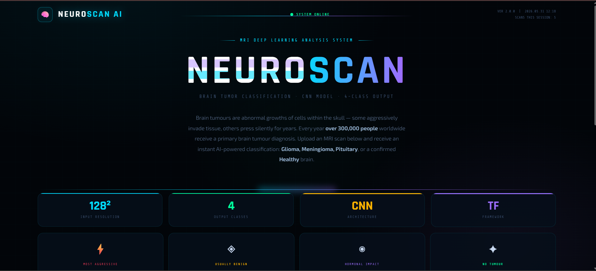
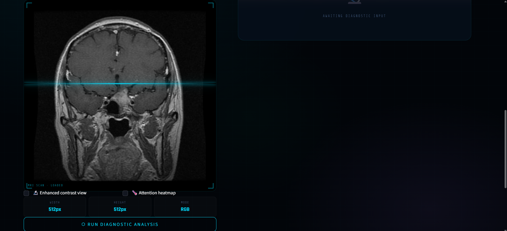
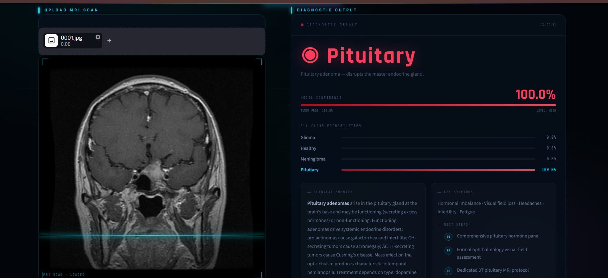

# Brain Tumor Detection using Deep Learning

A deep learning-based web application that detects brain tumors from MRI scans using CNN and Streamlit.

## Features
- MRI image classification
- Real-time prediction
- Confidence score visualization
- Brain tumor probability detection
- Modern Streamlit user interface

## Tumor Classes
- Glioma
- Meningioma
- Pituitary
- Healthy

## Technologies Used
- Python
- TensorFlow / Keras
- CNN
- Streamlit
- NumPy
- Pillow

## Deep Learning Workflow
- Image preprocessing
- Image resizing (128x128)
- Normalization
- CNN model prediction
- Multi-class classification

## Run Locally

```bash
pip install -r requirements.txt
streamlit run TumorTesting.py
```

## Application Preview

### Home Page


### Upload Interface


### Prediction Result


## Note
Model file not uploaded due to GitHub file size limits.

## Disclaimer
This project is for educational purposes only and not for real medical diagnosis.